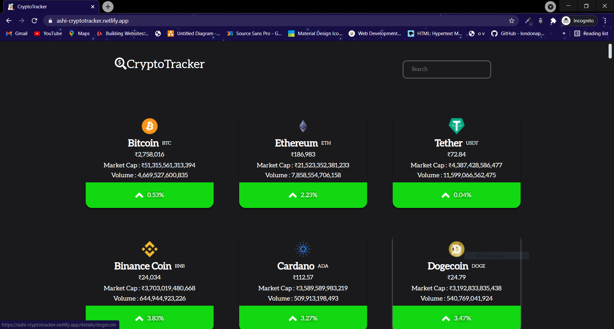

# Chatz
> A crypto currency tracker app which tracks many crypto currency and also shows trends in graphical form 
> [Live Demo](https://ashi-cryptotracker.netlify.app/)

## Table of contents
* [General info](#general-info)
* [Screenshots](#screenshots)
* [Technologies](#technologies)
* [Setup](#setup)
* [Features](#features)
* [Status](#status)

## General info
The web application is a crypto currency tracking app which show market captial, volume and price of a crypto currency. The app also provides market trend of a particular curreny is a graphical form. The app shows trends for a particular currency as old as 10+ years. For data coingecko api are used as they are one of the best crypto currency related api available. The app is bulid using react. For making api calls axios is used. For dynamic routing react-router-dom is used.
## Screenshots

Home Page 

Favourites Page

Detailed Movies Page

## Technologies
* React - version 17.0.2
* react-router - version 5.0.2
* Firebase - version 8.5.0 
* Material UI - version 16.8.0

## Setup

In the project directory, first install all the dependenices run:
## `npm install`

To start the project in the project directory run:
## `npm start`

## Features
List of features ready and TODOs for future development
* Bookmark Section
* Detail Page for each movie

To-do list:
* Responsive
* Availiblity on different streaming flatform

## Status
Project is : _in progess_
